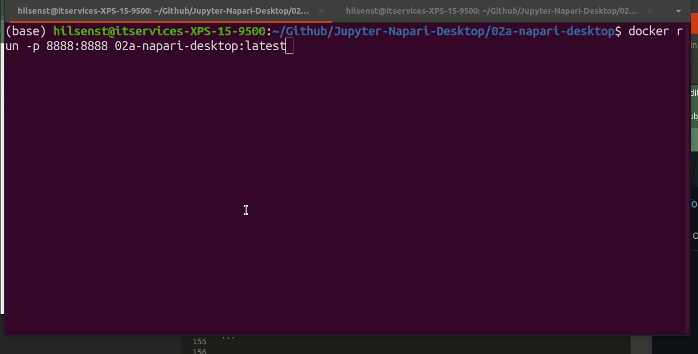
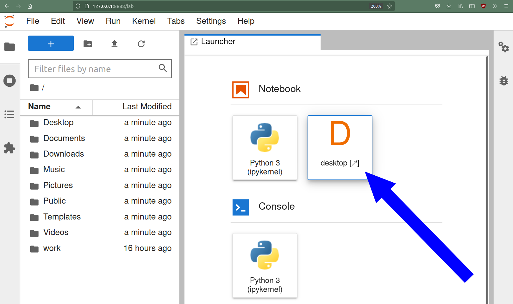
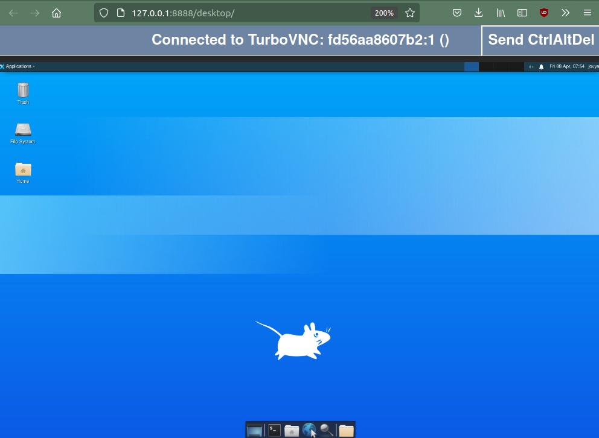

# WORK IN PROGRESS (should really be in a branch and not in main)

# Setting up a remote desktop to use Napari in a browser

* Do you want to run a course/workshop on napari or other GUI based-tools and worry how all participants can have a working python environment?
* Do you want to deploy some software that needs a GUI on a powerful-GPU workstation with good connection to the storage where users have large datasets?

Setting up a remote desktop environment that can be accessed via a web browser might be a possible solution to these problems.
This repo contains some basic documentation on how to set up such a remote desktop environment with Docker containers. It is based on 
[jupyter-desktop-server by yuvipanda](https://github.com/yuvipanda/jupyter-desktop-server). A similar approach has been used with binder in NEUBIAS training for napari based on an idea by [guiwitz](https://github.com/guiwitz/).

# tl\;dr 

```
docker run --rm -p 8888:8888 opticalflow/02a-napari-desktop:latest
```



# Simple Recipe to build a jupyter desktop image with napari

## Docker and containers

If you never heard about Docker and containers, it is probably a good idea to read or watch a short introductory tutorial.
As a minimum requirement you need to install docker on your system. The basic instructions should work on Linux, Windows and Mac but the author has only tested them on Linux. In particular, shell scripts might differ a bit on windows depending on whether you use `cmd.exe`, Powershell or `bash` from WSL2. 
If you plan on providing CUDA-based GPU acceleration for machine learning libraries (`tensorflow`, `pytorch`) or array libraries (`cupy`) make sure you install the NVIDIA-Docker runtime (NVIDIA docker is limited to Linux and not supported on Mac. It may work on windows using WSL2).

## Build the base image

As a first step, we just build a docker image to run a bare-bones jupyter desktop. All the necessary files are in [`01-jupyter-desktop`](./01-jupyter-desktop). This have basically just been vendored (fancy name for copied into this repo) from the official [Jupyter Remote Desktop Proxy](https://github.com/jupyterhub/jupyter-remote-desktop-proxy) with minor modifications. 
In particular, we make the following modifications:
* In the first line of the [Dockerfile](./01-jupyter-desktop/Dockerfile) we choose a more recent docker base image from the jupyter project after `FROM:`. For a list of the base image tags see here (https://hub.docker.com/r/jupyter/base-notebook/tags). To learn more about what's in the base images refer to the Jupyter docker stacks documentation [here](https://jupyter-docker-stacks.readthedocs.io/en/latest/using/selecting.html).
* We install a number of additional ubuntu packages, that we will need for subsequent build steps that will be based on our base dektop docker image. In particular we add  `libqt5x11extras5-dev` which will later be needed for napari and  `build-essential` which is needed for e.g. scikit-image. Other additions are mainly for convenience when working with the desktop `nano`, `vim`, `mousepad` provide a selection of editors and `git` is always handy. 

If you clone this repository and `cd` into the `01-jupyter-desktop` you can now build the base image as follows 
```sh
~/Jupyter-Napari-Desktop/01-jupyter-desktop$ docker build -t 01-jupyter-desktop .
```
We tell docker to tag the image as `01-jupyter-desktop`. This is the name we will refer to in the second build step, when we add napari.

This will take a while and download several 100 MBytes so it is good to do this with a good internet connection. Sometimes, this will break because some package servers are offline or time out, in that case just try again..

You will first see how this pulls the base image layers. Ob subsequent runs this will be faster as the layers are cached.

```sh
Sending build context to Docker daemon   32.2MB
Step 1/10 : FROM jupyter/base-notebook:python-3.9.10
python-3.9.10: Pulling from jupyter/base-notebook
e0b25ef51634: Downloading [=======================>                           ]  13.23MB/28.57MB
a9d22f8daec9: Downloading [================>                                  ]  11.52MB/34.84MB
0024e5e05bc9: Download complete 
4f4fb700ef54: Download complete 
33a6bebb46b2: Download complete 
76608c7ca4ff: Download complete 
51d29749a235: Download complete 
f953c74f23c7: Downloading [====>                                              ]  8.571MB/89.48MB
9e979eadccf1: Waiting 
c0a46d57a185: Waiting 
5ce1bbf82dba: Waiting 
2c62e20c0d49: Waiting 
```

This will be followed by output regarding the download of ubuntu packages and installing a python environment.
Eventually you should see something like:

```
Successfully built 4159451e1e74
Successfully tagged 01-jupyter-desktop:latest
```
where the exact hash number of the image will be different.


## Start the base image

If the previous step worked, you can now run the base image

```
docker run --rm -p 8888:8888 01-jupyter-desktop:latest 
```

Here, we map the network port `8888` from within the image to the same port number of the host. 
If you already have something else (e.g. a jupyter notebook) running on port `8888` of the host you will have to map
it to a free port number instead.

You will see some console output, that should include a link towards the end:

```
[...]

    To access the server, open this file in a browser:
        file:///home/jovyan/.local/share/jupyter/runtime/jpserver-8-open.html
    Or copy and paste one of these URLs:
        http://347a800ec507:8888/lab?token=eb1a238cef1e1bcc579c508cacc53720ba3fd1775b0844b2
     or http://127.0.0.1:8888/lab?token=eb1a238cef1e1bcc579c508cacc53720ba3fd1775b0844b2

```
If you open the link pointing to  `127.0.0.1` you should be greeted with a jupyterlab environment:



If you click on the Desktop icon, you should see the base desktop.



## Some words about the Desktop

Note that by default, the user in the desktop is `jovyan`. This is the default for the jupyter base images.
You can create files in `jovyan`'s home directory and work with the Deskop, **but be aware that the container
environment is ephemeral, i.e. none of the files or other changes you make within the Deskop will persist
when the Container is closed**.

## Add a python environment with `napari`

The bare-bone desktop can already be used to run python commands. But what we really want is to deploy software for users,
in this case: `napari`.

### Modifying the base image or building on top?

We could just take the existing Dockerfile and add additional lines of code that will install napari into the pyhton environment.
However, a better approach is to create a new Dockerfile that builds on our existing base image `01-jupyter-desktop` which we
created in the previous step. This avoids rebuilding the base image and also allows for swapping out the base image. In other words it is a
more modular approach.

Have a look at [02a-napari-desktop/Dockerfile](./02a-napari-desktop/Dockerfile). In the first line, we tell docker to use the image we built
in the previous step as the base image:

```
FROM 01-jupyter-desktop:latest
```

We then change permissions to `root`. The following command creates a new conda enviornment called napari

```
RUN source /opt/conda/etc/profile.d/conda.sh \
  && conda create --yes --name napari python=3.9 \
  &&  conda run --name napari python -m pip install napari[all] 
```

### Customizations

To make the desktop our own, we add some customizations.
Here, we replace the desktop logo:
```
COPY ./background.png /usr/share/backgrounds/xfce/xfce-stripes.png
RUN chmod a+r /usr/share/backgrounds/xfce/xfce-stripes.png
```
and here we add a menu shortcut:
```
COPY ./Napari.desktop /usr/share/applications/Napari.desktop
```

### Build and run

Now, `cd` into `02a-napari-desktop` and build the image:

```sh
Jupyter-Napari-Desktop/02a-napari-desktop$ docker build -t 02a-napari-desktop .
```

Upon succesful completion, you should be able to run:

```sh 
docker run --rm -p 8888:8888 02a-napari-desktop:latest
```

And when starting the desktop you should see this:


# Add GPU support

## Requirements

If you have a CUDA compatible NVIDIA card, you can install nvidia-docker and also have GPU support for compute in your container.
The only difference is that you need to run docker with the ``--gpus=all` option.
To test whether you have the nvidia-docker runtime with CUDA support working correctly try running `nvidia-smi` inside the container.


```sh
Jupyter-Napari-Desktop$ docker run --gpus=all 02a-napari-desktop:latest nvidia-smi
Fri Apr  8 09:43:06 2022       
+-----------------------------------------------------------------------------+
| NVIDIA-SMI 470.103.01   Driver Version: 470.103.01   CUDA Version: 11.4     |
|-------------------------------+----------------------+----------------------+
| GPU  Name        Persistence-M| Bus-Id        Disp.A | Volatile Uncorr. ECC |
| Fan  Temp  Perf  Pwr:Usage/Cap|         Memory-Usage | GPU-Util  Compute M. |
|                               |                      |               MIG M. |
|===============================+======================+======================|
|   0  NVIDIA GeForce ...  Off  | 00000000:01:00.0 Off |                  N/A |
| N/A   60C    P8     3W /  N/A |   1744MiB /  3914MiB |     20%      Default |
|                               |                      |                  N/A |
+-------------------------------+----------------------+----------------------+
                                                                               
+-----------------------------------------------------------------------------+
| Processes:                                                                  |
|  GPU   GI   CI        PID   Type   Process name                  GPU Memory |
|        ID   ID                                                   Usage      |
|=============================================================================|
+-----------------------------------------------------------------------------+
```
If you see something similat to this, your CUDA support inside the container is working.
However, if you don't have nvidia docker and the drivers set up correctly, you will see an error message such as `nvidia-smi` not found.

## GPU Exmaple: Cellpose and Cellpose Napari Plugin

As an example we modify the napari desktop slightly to also add cellpose and the cellpose GPU plugin. Cellpose training greatly benefits from 
having a powerful GPU. As many users don't have powerful GPUs on their laptops, enabling remote desktop access to a powerful GPU workstation
is one of the use cases for setting up a custom Jupyter Desktop.

# Mount Volumes

Follow the instructions for docker to mount volumes.
In the simplest case, you can add a commandline option such as `-v local/folder/xyz:/home/jovyan/xyz` to make the folder available in the image.
Files that are written into the folder `/home/jovyan/xyz` will then be stored on the host in the specified folder (assuming you set the permissions
correctly) and can persist across sessions.

# Build images in CI

TODO Explain how to build docker images in CI rather than following these manual steps
* kaniko on gitlab
* Github actions?

# Deploy on a server for multiple users

## Jupyterhub

Single Server:
* set up minikube (TODO)
* install jupyterhub with helm following jupyterhub zero to hero (TODO)
* edit config.yaml for jupyterhub helm recipe to add your desktop container (TODO)
* user access and auth (TODO)
* persistent volume claims

Cluster:
Talk to your IT department.

## Custom solution
TODO

# Acknowlegements

This is based on the work of Yuvi Panda and the Jupyter Project.
Using napari on binder was inspired by G. Witz.
Some of these instructions are based on things that EMBL Bio-IT (R. Alves, J. Moscardo) and my colleague A. Eisenbarth figured out.